# معرض لقطات smmnine

هذه المكتبة تضم لقطات الشاشة التي جُمعت أثناء تطوير واختبار واجهات smmnine. تم الاحتفاظ بالصور داخل المستودع لتوثيق التصميم الجديد، وليس باعتبارها بديلًا عن فحص الكود أو الاختبارات الآلية.

> بعض الصور لقطات اختبار تاريخية أو صور مقارنة قبل/بعد. لا تُستخدم أي بيانات دخول ظاهرة في الصور كبيانات إنتاج، ولا تحتوي هذه المكتبة على `.env.local` أو مفاتيح API أو رموز Turso.

## لقطات smoke على عرض 390px

| الشاشة | الصورة |
|---|---|
| تسجيل الدخول |  |
| الخدمات |  |

## الهوية وتسجيل الدخول

| الوصف | الصورة |
|---|---|
| شاشة الدخول النهائية |  |
| شاشة الدخول الكاملة | 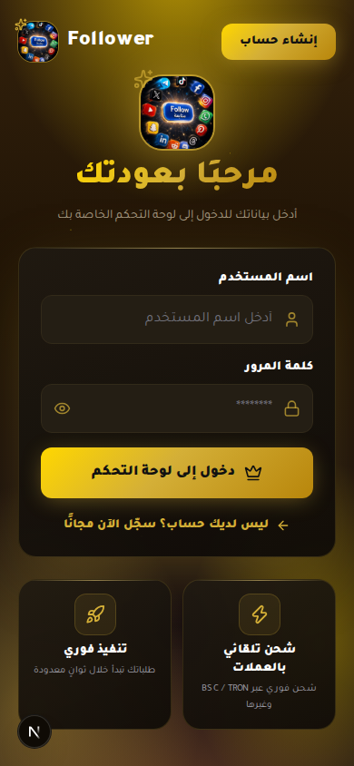 |
| تصميم شاشة الدخول | 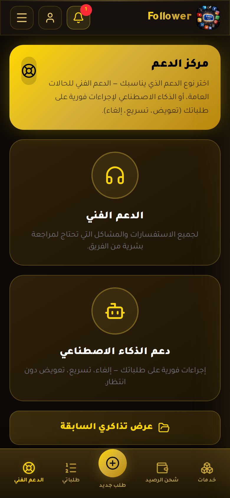 |
| زر الدخول |  |
| نسخة بدون مؤشر |  |
| نسخة الإنتاج البصرية |  |

## لوحة المستخدم والخدمات والطلبات

| الوصف | الصورة |
|---|---|
| الخدمات |  |
| الطلبات | 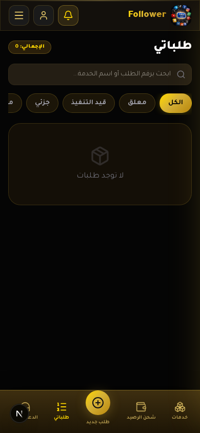 |
| طلبات باللغة الإنجليزية | 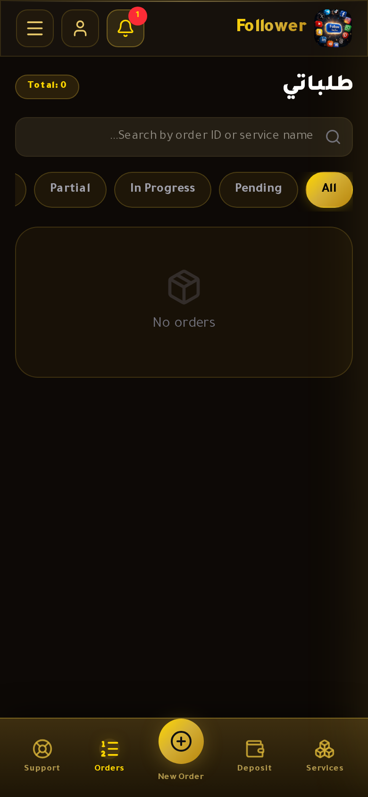 |
| الطلبات بالذهبي | 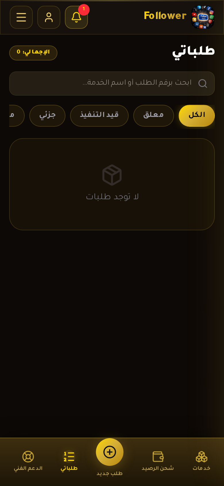 |
| مستخدم بعد الدخول | 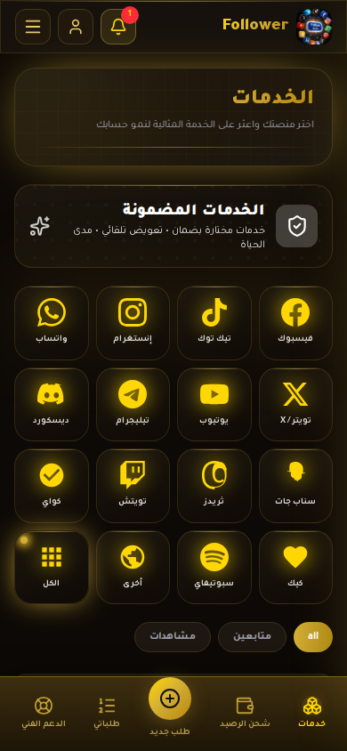 |
| طلبات المستخدم | 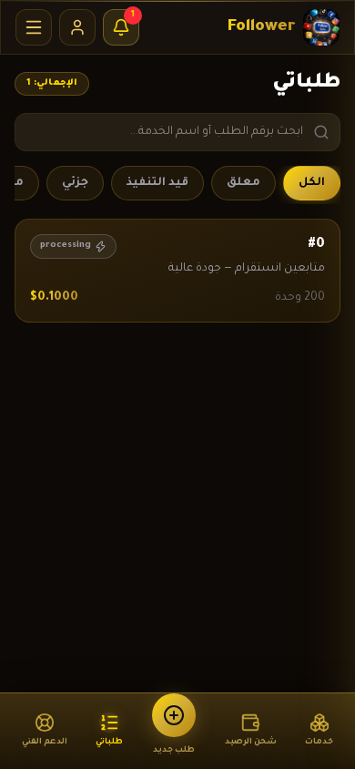 |
| خدمات المستخدم | 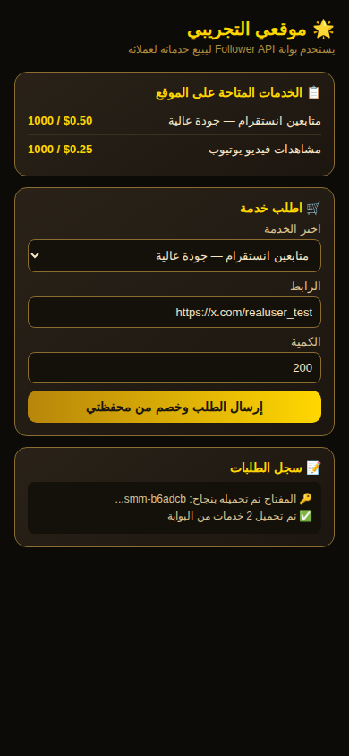 |
| خدمة واحدة |  |
| خدمتان |  |
| طلب تجريبي غير مدفوع | 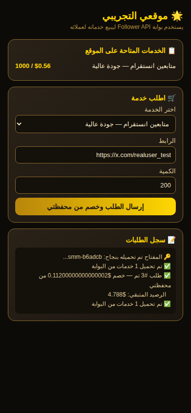 |

## API v2

| الوصف | الصورة |
|---|---|
| صفحة API الأساسية | 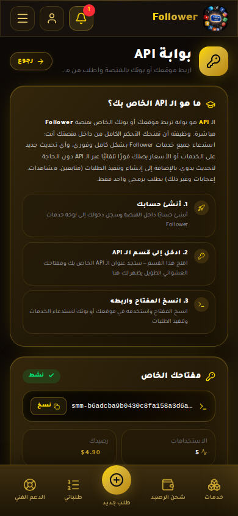 |
| أسفل صفحة API | 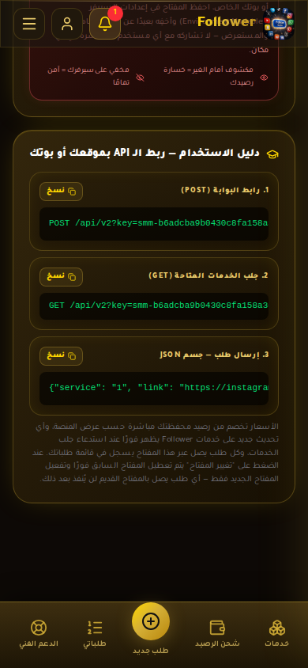 |
| واجهة API الذهبية |  |
| API باللغة الإنجليزية |  |
| API الكاملة | 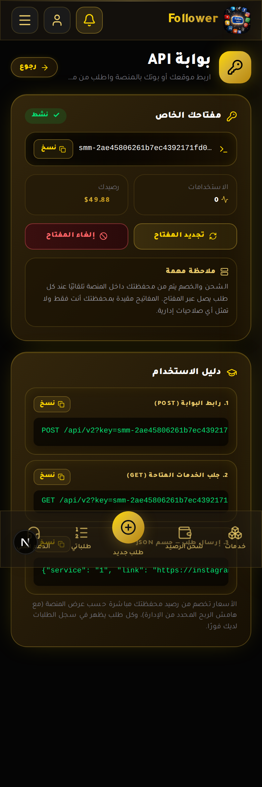 |
| صفحة API الجديدة | 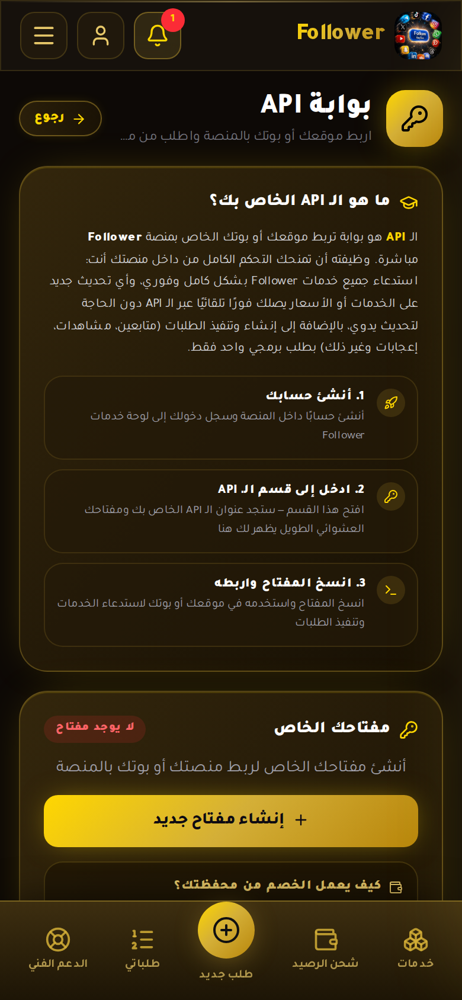 |
| أسفل صفحة API الجديدة | 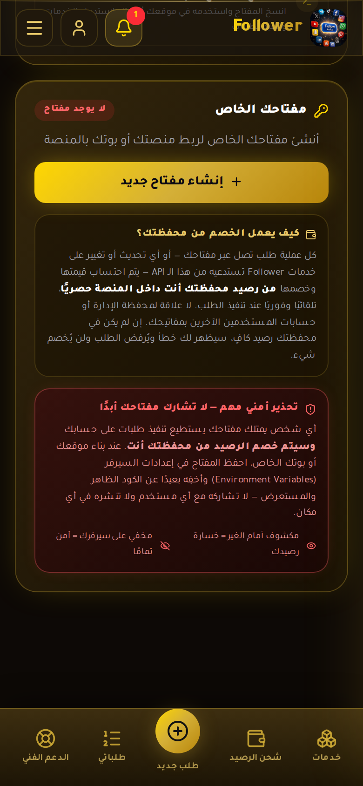 |

## الإيداع والشحن

| الوصف | الصورة |
|---|---|
| واجهة الإيداع Royal Gold | 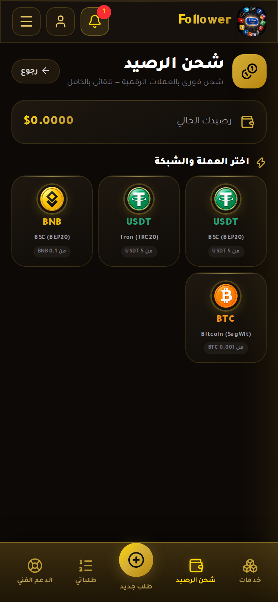 |

العناوين الفعلية للشبكات لا تُكتب في هذا المعرض؛ تُقرأ من Turso وقت التشغيل حتى لا تنتشر إعدادات الدفع في التوثيق أو Git.

## الإدارة والمزودون

| الوصف | الصورة |
|---|---|
| دخول الإدارة في اختبار الواجهة | 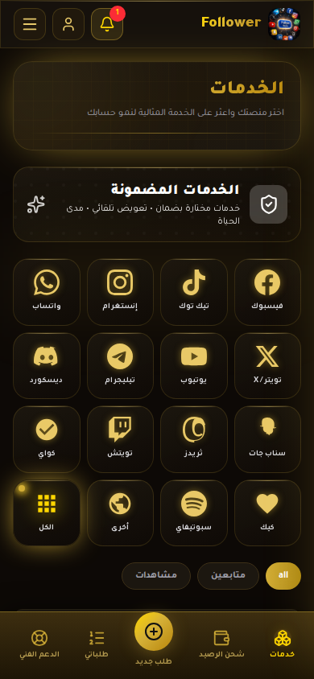 |
| لوحة مزودي الخدمات | 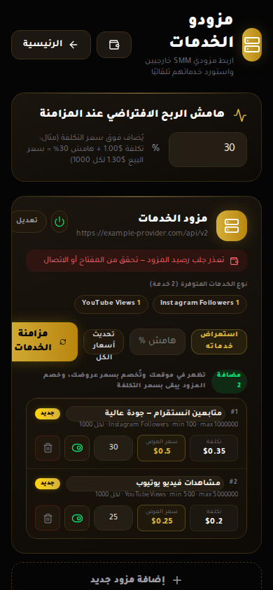 |
| تعديل اسم أو سعر خدمة |  |
| تغيير السعر | 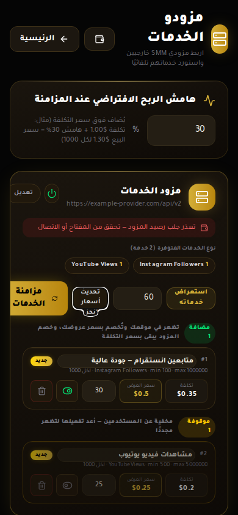 |
| نتيجة تغيير السعر | 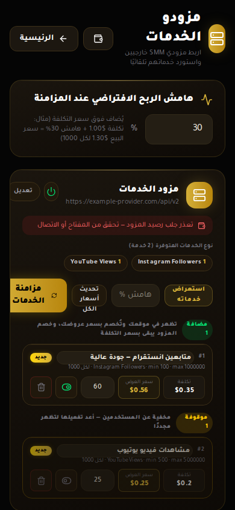 |
| إرجاع الإعداد بعد الاختبار |  |
| إخفاء خدمة في واجهة المستخدم |  |
| ظهور السعر بعد التعديل |  |
| قبل تعديل السعر | 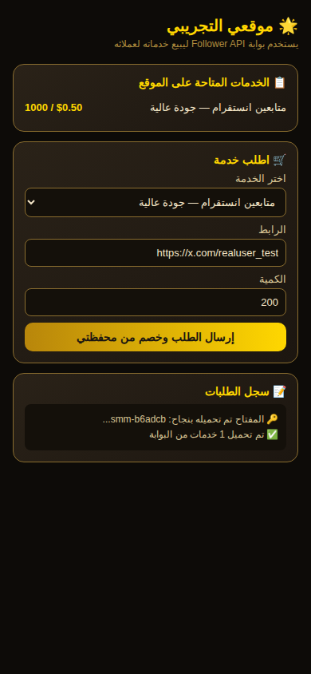 |

## الدعم واللغات والتنقل

| الوصف | الصورة |
|---|---|
| الدعم بالذهبي | 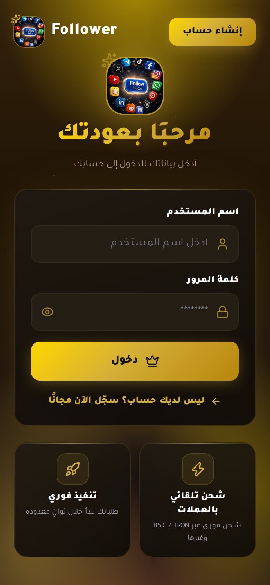 |
| الدعم بالإنجليزية |  |
| التذاكر | 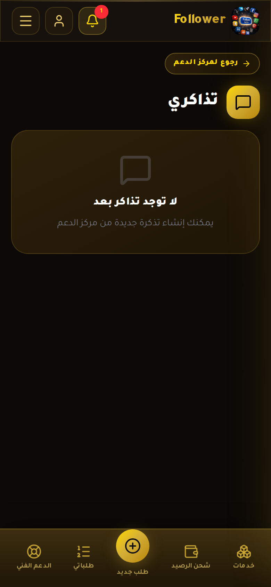 |
| لوحة اللغة |  |
| الإنجليزية |  |
| القائمة المفتوحة | 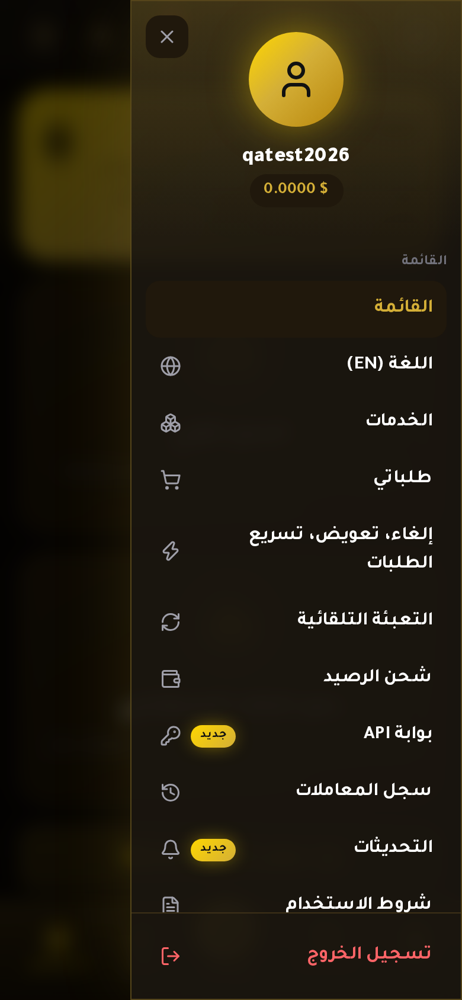 |
| التنقل النهائي |  |
| شريط التنقل السفلي | 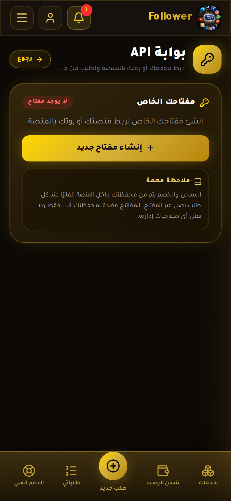 |
| اختبار إخفاء التنقل | 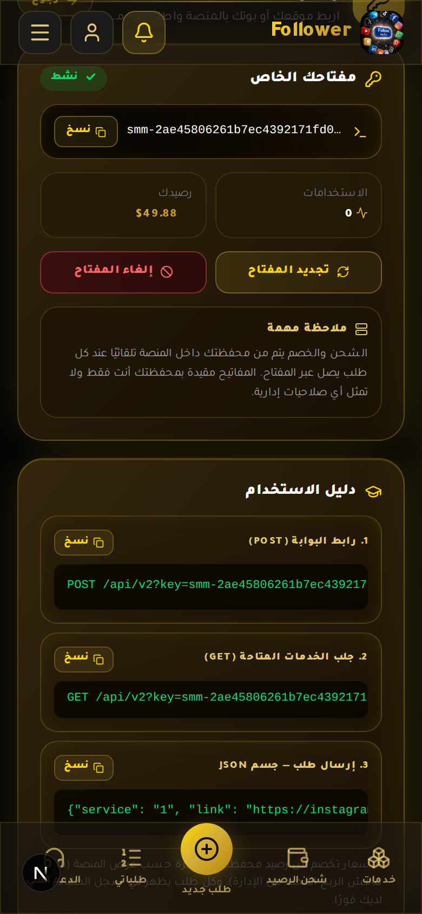 |

## صور المقارنة والاختبارات البصرية

المجلد `ui/` يحتوي كذلك على صور المقارنة المرحلية مثل `bisect_n.png` و`blank_n.png` و`bottom_zoom.png` و`n_fixed.png` و`n_zone.png` و`no_fixed.png` وغيرها. تم الاحتفاظ بها حتى تكون كل مراحل تحسين التجاوب والتنقل قابلة للمراجعة من سجل Git.

## صورة المرجع المرفقة

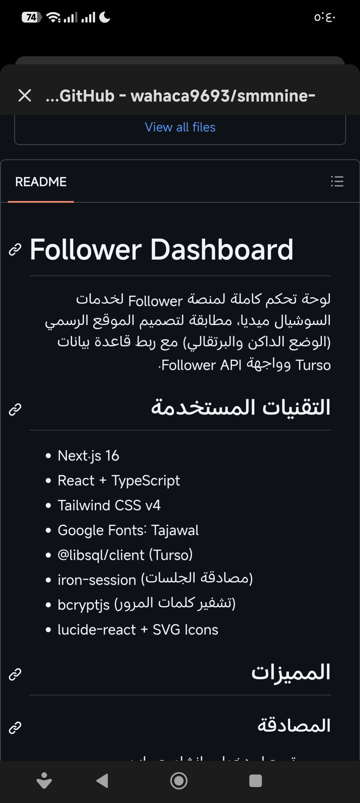

هذه الصورة مرجع مرئي لعرض README على الهاتف، وليست لقطة من بيئة الإنتاج.

## ملاحظة أمنية

لا تُدخل كلمات المرور أو مفاتيح API أو رموز Turso أو مفاتيح NOWPayments في لقطات جديدة. إذا ظهرت معلومة حساسة في لقطة اختبار، يجب حذف الصورة أو استبدالها قبل استخدامها في توثيق عام.
