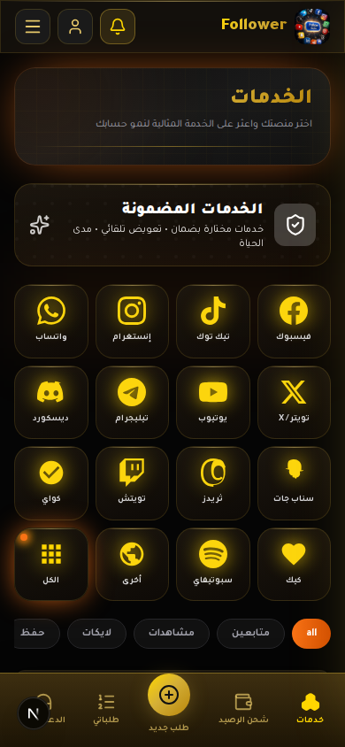
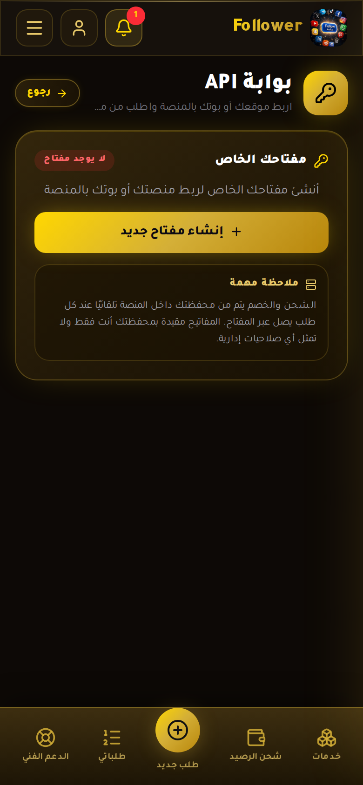
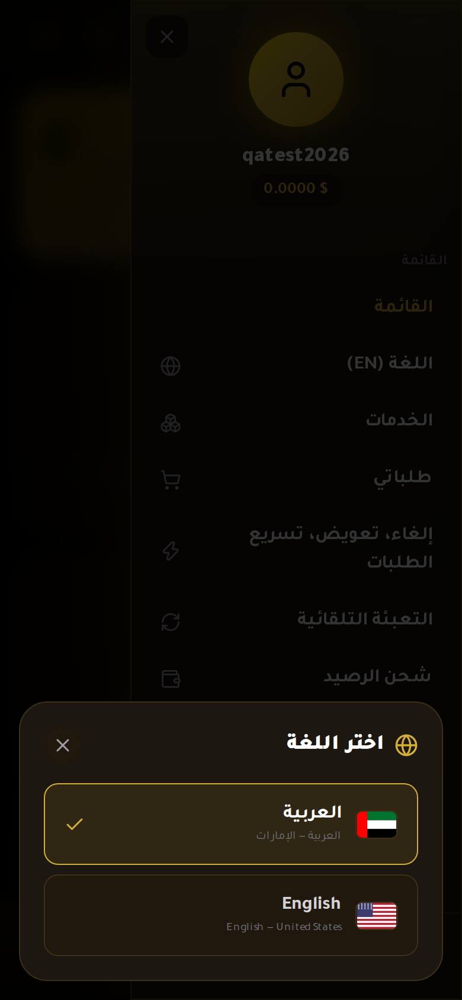
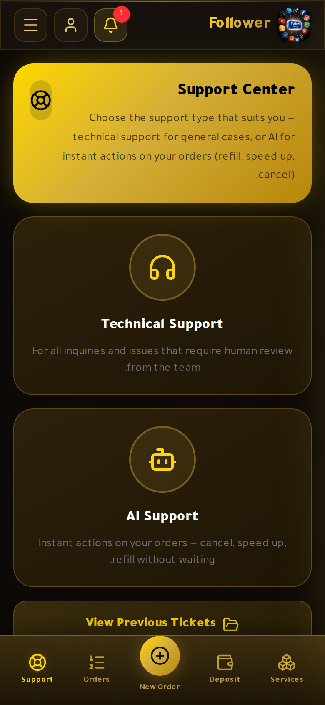
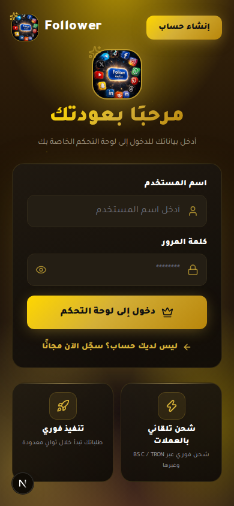
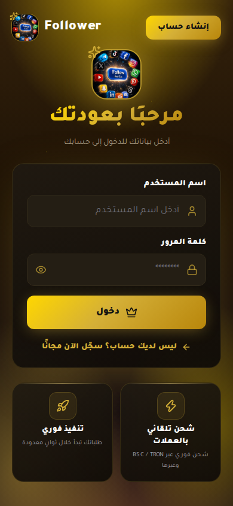

# معرض متجر smmnine العام

هذا المعرض مخصص لعرض **واجهة المتجر العامة** وما يراه الزائر أو المستخدم، وليس لتوثيق لوحة الإدارة أو الاختبارات الداخلية. تم استبعاد لقطات admin، مفاتيح API، تغييرات الأسعار الداخلية، بيانات المستخدمين، ولقطات الجلسات الخاصة.

## تسجيل الدخول وإنشاء الحساب

توضح هذه الصور الهوية البصرية Royal Gold، شاشة الدخول، زر إنشاء الحساب، وتخطيط الهاتف.

| الصورة | المعاينة |
|---|---|
| [`login_screen.png`](auth/login_screen.png) |  |
| [`final_login.png`](auth/final_login.png) |  |
| [`login_button_new.png`](auth/login_button_new.png) |  |

## الخدمات وما يقدمه المتجر

توضح هذه الصور كتالوج الخدمات، أنواع الخدمات، الأسعار، وتنظيم الواجهة للمستخدم.

| الصورة | المعاينة |
|---|---|
| [`check_services.png`](store/check_services.png) |  |
| [`orders_gold.png`](store/orders_gold.png) |  |
| [`check_orders.png`](store/check_orders.png) |  |

## الطلبات

تعرض لقطات الطلبات شكل بطاقات الطلب، الحالات، والتنقل، من دون عرض صور الإدارة أو بيانات تشغيل خاصة.

| الصورة | المعاينة |
|---|---|
| [`check_orders.png`](store/check_orders.png) |  |
| [`orders_gold.png`](store/orders_gold.png) |  |

## الإيداع والعملات والشبكات

توضح الصورة واجهة الإيداع واختيار العملة والشبكة. العناوين الفعلية لا تُكتب في GitHub؛ تُقرأ من Turso وقت التشغيل لحماية إعدادات الدفع ومنع نسخ عنوان خاطئ.

| الصورة | المعاينة |
|---|---|
| [`deposit_gold.png`](payments/deposit_gold.png) |  |

## API للمستخدم

توضح هذه الصور صفحة API التعريفية التي تشرح للمستخدم كيف يستخدم مفتاحه من موقع أو Bot، مع إبقاء القيمة السرية للمفتاح خارج الصور والمستودع.

| الصورة | المعاينة |
|---|---|
| [`api_gold.png`](api/api_gold.png) |  |
| [`api_en.png`](api/api_en.png) |  |
| [`api_full.png`](api/api_full.png) |  |

## الدعم

توضح الصور الواجهة العامة للدعم والتذاكر التي يمكن للمستخدم الوصول إليها.

| الصورة | المعاينة |
|---|---|
| [`support_gold.png`](support/support_gold.png) |  |
| [`support_en.png`](support/support_en.png) |  |
| [`tickets_gold.png`](support/tickets_gold.png) |  |

## اللغات

توضح الصور اختيار اللغة العربية والإنجليزية، مع تصميم واضح داخل إعدادات المستخدم.

| الصورة | المعاينة |
|---|---|
| [`lang_panel.png`](language/lang_panel.png) |  |
| [`lang_en.png`](language/lang_en.png) |  |

## التنقل والتجاوب

توضح هذه الصور القائمة والتنقل السفلي وتصميم الهاتف.

| الصورة | المعاينة |
|---|---|
| [`nav_final.png`](navigation/nav_final.png) |  |
| [`nav_bottom_new.png`](navigation/nav_bottom_new.png) |  |
| [`menu_open.png`](navigation/menu_open.png) |  |
| [`login-390.png`](mobile/login-390.png) |  |
| [`services-390.png`](mobile/services-390.png) |  |

> الصور هنا توثيق بصري للواجهة العامة. لا تمثل هذه الصور اعتمادًا نهائيًا للدفع أو تنفيذ طلب خدمة حقيقي، ولا ينبغي استخدامها لإثبات تشغيل بوابة دفع إنتاجية قبل اكتمال NOWPayments IPN وتدوير المفاتيح السرية.
